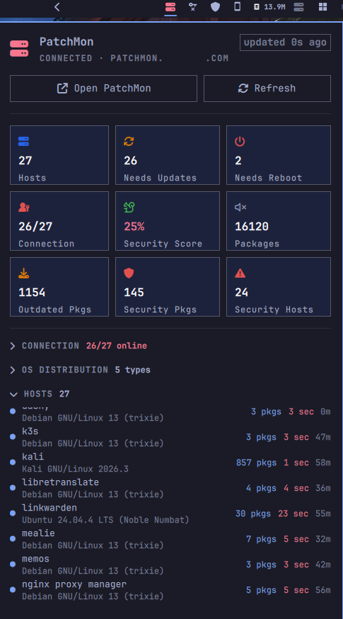

# PatchMon Panel for Omarchy

A status-bar widget for [Omarchy](https://omarchy.org/) that surfaces your
[PatchMon](https://patchmon.net/) fleet at a glance and lets you drill into
per-host detail — without leaving your desktop.




## What it shows

A single bar icon (a server glyph) coloured by fleet health:

- **green** — everything up to date and online
- **amber** — some hosts have pending updates / reboots
- **red** — security updates pending, hosts offline, or PatchMon unreachable

Click it (or press the plugin's popout key) to open a panel with:

### Dashboard cards

| Card | Source |
|------|--------|
| Total Hosts | `hosts` array length |
| Needs Updates | hosts with `updates_count > 0` |
| Needs Reboot | hosts with `needs_reboot` |
| Connection | hosts whose last check-in is within `staleAfterMin` (`connected/offline`); the Integration API does not expose `reporting_state`, so connectivity is derived from `last_update` recency |
| Security Score | derived (see below) |
| Packages | sum of `total_packages` |
| Outdated Packages | sum of `updates_count` |
| Security Packages | sum of `security_updates_count` |
| Outdated Hosts | hosts with `updates_count > 0` |

### Collapsible sections

- **Connection** — online vs offline/stale counts.
- **Hosts** — every host grouped into *Offline / Stale*, *Needs Reboot*,
  *Needs Updates* and *Up to Date*, each row showing OS, pending package
  count, security count and a reboot indicator. Scrolls if the list is long.
- **OS Distribution** — share of each operating system as a proportional bar.

A footer offers **Open PatchMon** (opens the server URL in your browser) and
**Refresh** (also bound to the `r` key while the panel is open).

## The derived "Security Score"

PatchMon's API does not expose a single security score, so this plugin
computes one from the fleet:

```
score = 100 − round( 50·(securityHosts/total)
                    + 20·(rebootHosts/total)
                    + 30·(updateHosts/total) )
```

i.e. security updates weigh most, then pending reboots, then outstanding
updates. It is a quick at-a-glance health indicator, not an audit — treat it
as such.

## Requirements

- Omarchy (Quickshell shell) on the client.
- A reachable PatchMon **2.x** instance.
- An **Integration API** token with the `host:get` scope
  (Settings → Integrations → API). This is a *different* token type from the
  GetHomepage widget token.

## Install

Clone (or copy) this repository into your Omarchy plugin directory:

```bash
git clone https://github.com/tug-benson/omarchy-patchmon-panel \
  ~/.config/omarchy/plugins/io.github.tug-benson.patchmon
```

Or symlink it during development:

```bash
ln -s /path/to/omarchy-patchmon-panel \
  ~/.config/omarchy/plugins/io.github.tug-benson.patchmon
```

Then add the widget to a bar section in `~/.config/omarchy/shell.json`, e.g.
under `bar.layout.right`:

```json
{
  "id": "io.github.tug-benson.patchmon",
  "serverUrl": "https://patchmon.example.com",
  "apiKey": "patchmon_ae_xxxxxxxx",
  "apiSecret": "yyyyyyyyyyyy",
  "refreshIntervalSec": 60
}
```

The shell hot-reloads on save. Click the server icon to open the panel.

> Secrets live only in your local `shell.json` — they are never part of this
> repository. Restrict the token's IP range and set an expiry in PatchMon for
> good measure.

### Configuration keys

| Key | Type | Default | Notes |
|-----|------|---------|-------|
| `serverUrl` | string | — | Base URL, e.g. `https://patchmon.example.com` |
| `apiKey` | string | — | Integration API token key |
| `apiSecret` | string | — | Integration API token secret |
| `hostGroup` | string | `""` | Optional: only show one PatchMon host group |
| `refreshIntervalSec` | int | `60` | Poll interval (clamped 15–600) |

## How it works

The widget calls `GET /api/v1/api/hosts?include=stats` on the PatchMon
Integration API with HTTP Basic auth (base64 of `apiKey:apiSecret`). All
metrics and the per-host breakdown are aggregated locally from that single
response, so one scoped, read-only token is enough for everything.

## License

MIT — see [LICENSE](LICENSE).
